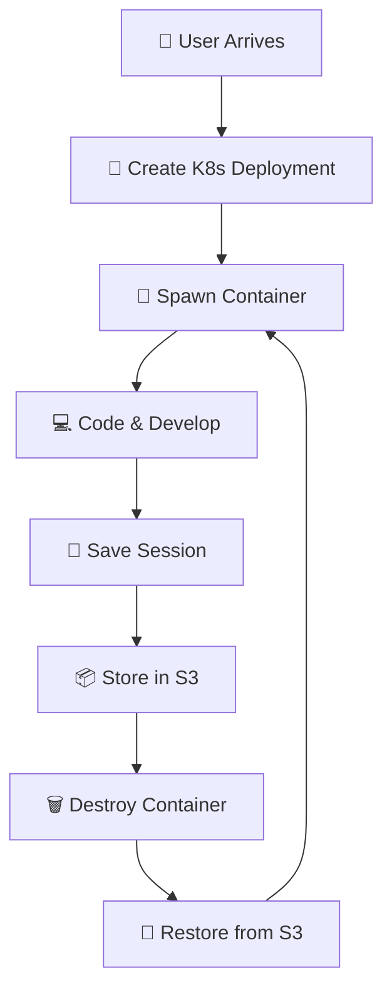

# 🚀 DevEx - Minimal REPL-as-a-service

<div align="center">


[](https://opensource.org/licenses/MIT)
[](https://golang.org/)
[](https://nextjs.org/)
[](https://www.typescriptlang.org/)
[](https://kubernetes.io/)
[](https://redis.io/)
[](https://aws.amazon.com/s3/)

**✨ A modern, cloud-native IDE platform inspired by Repl.it ✨**

*Code anywhere, anytime, with the power of Kubernetes orchestration*

</div>

---

## 🎯 What is DevEx?

DevEx is a **cutting-edge cloud IDE platform** that brings the power of containerized development environments to your fingertips. Think Repl.it, but with enterprise-grade Kubernetes orchestration, ephemeral containers, and seamless data persistence.

### 🌟 The Magic Behind DevEx



---

## ⚡ Key Features

<table>
<tr>
<td width="50%">

### 🏗️ **Cloud-Native Architecture**
- **Kubernetes Orchestration** - Dynamic container lifecycle
- **Ephemeral Containers** - Fresh environment every session
- **Auto-scaling** - Handle thousands of concurrent users

### 🔐 **Secure & Authenticated**
- **GitHub OAuth 2.0** - One-click authentication
- **Session Management** - Secure user sessions with Redis
- **Isolated Environments** - Each user gets their own container

</td>
<td width="50%">

### 💾 **Smart Data Persistence**
- **S3 Integration** - Automatic project backup/restore
- **Redis Caching** - Lightning-fast session data
- **Stateless Design** - No data loss, ever

### 🎨 **Modern UI/UX**
- **Next.js 14** - Server-side rendering & performance
- **Real-time Terminal** - WebSocket-powered PTY
- **File Management** - Full-featured file explorer

</td>
</tr>
</table>

---

## 🏛️ Architecture Overview

<div align="center">

```
┌─────────────────┐    ┌─────────────────┐    ┌─────────────────┐
│   🌐 Web UI      │    │  🔧 Core API     │    │ 🏃 Runner Service│
│   (Next.js)     │◄──►│   (Go)          │◄──►│    (Go)         │
│                 │    │                 │    │                 │
│ • React/TS      │    │ • REST API      │    │ • WebSocket     │
│ • TailwindCSS   │    │ • Auth Handler  │    │ • PTY/Terminal  │
│ • WebSocket     │    │ • K8s Manager   │    │ • File System   │
└─────────────────┘    └─────────────────┘    └─────────────────┘
         │                       │                       │
         └───────────────────────┼───────────────────────┘
                                 │
        ┌────────────────────────┼────────────────────────┐
        │                       │                        │
┌───────▼────┐         ┌────────▼────┐         ┌────────▼────┐
│ 🚀 K8s     │         │ 📊 Redis    │         │ 📦 AWS S3   │
│ Cluster    │         │ Cache       │         │ Storage     │
│            │         │             │         │             │
│ • Pods     │         │ • Sessions  │         │ • Projects  │
│ • Services │         │ • User Data │         │ • Backups   │
│ • Ingress  │         │ • Metadata  │         │ • Templates │
└────────────┘         └─────────────┘         └─────────────┘
```

</div>

---

## 🚀 Quick Start

### Prerequisites

```bash
# Required tools
✅ Go 1.21+
✅ Node.js 18+
✅ Docker & Kubernetes
✅ Redis Server
✅ AWS S3 Bucket
```

### 1️⃣ Clone & Setup

```bash
# Clone the repository
git clone https://github.com/ParthKapoor-dev/devex.git
cd devex

# Install dependencies
go mod download
cd web && npm install
```

### 2️⃣ Environment Configuration

```bash
# Core service environment
cp core/.env.example core/.env

# Web application environment
cp web/.env.example web/.env.local
```

### 3️⃣ Start Services

```bash
# Start the core API server
cd core && go run cmd/main.go

# Start the web application
cd web && npm run dev

# Deploy runner image to your registry
cd runner && docker build -t your-registry/devex-runner .
```

### 4️⃣ Access DevEx

Open your browser and navigate to:
```
🌐 http://localhost:3000
```

---

## 📁 Project Structure

<details>
<summary>🔍 <strong>Click to expand project structure</strong></summary>

```
devex/
├── 🏗️  core/                    # Core API service (Go)
│   ├── cmd/
│   │   ├── api/                 # API endpoints
│   │   ├── main.go             # Entry point
│   │   └── middleware/         # HTTP middleware
│   ├── internal/
│   │   ├── k8s/                # Kubernetes operations
│   │   ├── oauth/              # GitHub OAuth config
│   │   ├── redis/              # Redis operations
│   │   ├── s3/                 # S3 operations
│   │   └── session/            # Session management
│   ├── models/                 # Data models
│   ├── services/               # Business logic
│   └── pkg/                    # Shared utilities
│
├── 🏃  runner/                  # Container runtime service (Go)
│   ├── cmd/api/                # Runtime API
│   ├── pkg/
│   │   ├── fs/                 # File system operations
│   │   ├── pty/                # Pseudo-terminal
│   │   └── ws/                 # WebSocket handling
│   └── dockerfile              # Container image
│
├── 🌐  web/                     # Frontend application (Next.js)
│   ├── app/                    # App router pages
│   ├── components/             # React components
│   │   ├── Auth/               # Authentication components
│   │   ├── sandbox/            # IDE components
│   │   └── ui/                 # UI components
│   ├── contexts/               # React contexts
│   ├── hooks/                  # Custom hooks
│   └── types/                  # TypeScript definitions
│
├── 📦  templates/               # Project templates
│   └── node-js/                # Node.js template
│
└── ☸️   k8s/                    # Kubernetes manifests
    └── ingress-controller.yaml
```

</details>

---

## 🎮 How It Works

### The DevEx Lifecycle

1. **🎯 User Authentication**
   ```
   User clicks "Login with GitHub" → OAuth flow → JWT token → Session created
   ```

2. **🏗️ Environment Creation**
   ```
   User creates/opens project → K8s deployment spawned → Container ready
   ```

3. **💻 Development Session**
   ```
   Code in browser → Real-time sync → File changes tracked → Terminal access
   ```

4. **💾 Session Persistence**
   ```
   User stops coding → Files zipped → Uploaded to S3 → Container destroyed
   ```

5. **🔄 Session Restoration**
   ```
   User returns → New container → Files downloaded from S3 → Ready to code
   ```

---

## 🛠️ Technology Stack

<div align="center">

| Layer | Technology | Purpose |
|-------|------------|---------|
| **Frontend** |    | Modern web interface |
| **Backend** |   | High-performance API |
| **Orchestration** |   | Container management |
| **Storage** |   | Data persistence |
| **Auth** |  | Authentication |

</div>

---

## 🎨 Screenshots & Demo

<div align="center">

### 🏠 Dashboard


### 💻 IDE Interface


### 📱 Mobile Responsive


</div>

---

## 🔧 Configuration

### Environment Variables

#### Core Service (`core/.env`)
```bash
# Server Configuration
PORT=8080
GIN_MODE=release

# Database
REDIS_URL=redis://localhost:6379
REDIS_PASSWORD=

# AWS S3
AWS_REGION=us-east-1
AWS_ACCESS_KEY_ID=your_access_key
AWS_SECRET_ACCESS_KEY=your_secret_key
S3_BUCKET_NAME=devex-storage

# GitHub OAuth
GITHUB_CLIENT_ID=your_github_client_id
GITHUB_CLIENT_SECRET=your_github_client_secret

# Kubernetes
KUBECONFIG=/path/to/kubeconfig
NAMESPACE=devex-workspaces
```

#### Web Application (`web/.env.local`)
```bash
# API Configuration
NEXT_PUBLIC_API_URL=http://localhost:8080
NEXT_PUBLIC_WS_URL=ws://localhost:8080

# Authentication
NEXTAUTH_URL=http://localhost:3000
NEXTAUTH_SECRET=your_nextauth_secret

# GitHub OAuth (same as core)
GITHUB_ID=your_github_client_id
GITHUB_SECRET=your_github_client_secret
```

---

## 🚀 Deployment

### Docker Compose (Development)

```yaml
version: '3.8'
services:
  redis:
    image: redis:alpine
    ports:
      - "6379:6379"

  core:
    build: ./core
    ports:
      - "8080:8080"
    depends_on:
      - redis
    environment:
      - REDIS_URL=redis://redis:6379

  web:
    build: ./web
    ports:
      - "3000:3000"
    depends_on:
      - core
```

### Kubernetes (Production)

```bash
# Apply Kubernetes manifests
kubectl apply -f k8s/

# Create namespace for user workspaces
kubectl create namespace devex-workspaces
```

---

## 🤝 Contributing

We ❤️ contributions! Here's how you can help:

1. **🍴 Fork** the repository
2. **🌟 Create** a feature branch (`git checkout -b amazing-feature`)
3. **💻 Commit** your changes (`git commit -m 'Add amazing feature'`)
4. **🚀 Push** to the branch (`git push origin amazing-feature`)
5. **📝 Open** a Pull Request

### Development Setup

```bash
# Install development dependencies
make dev-setup

# Run tests
make test

# Lint code
make lint

# Build for production
make build
```

---

## 📊 Roadmap

- [x] **Phase 1:** Core IDE functionality
- [x] **Phase 2:** Kubernetes integration
- [x] **Phase 3:** S3 persistence
- [ ] **Phase 4:** Collaborative editing
- [ ] **Phase 5:** Plugin system
- [ ] **Phase 6:** Mobile app
- [ ] **Phase 7:** Multi-language support
- [ ] **Phase 8:** AI-powered code assistance

---

## 📝 License

This project is licensed under the **MIT License** - see the [LICENSE](LICENSE) file for details.

---

## 🙏 Acknowledgments

- Inspired by [Repl.it](https://replit.com/) for the amazing IDE experience
- Built with ❤️ using modern cloud-native technologies
- Special thanks to the open-source community

---

<div align="center">

### 🌟 Star this repository if you found it helpful!

**Made with ❤️ by [ParthKapoor-dev](https://github.com/ParthKapoor-dev)**

[](https://github.com/ParthKapoor-dev/devex)
[](https://github.com/ParthKapoor-dev/devex)
[](https://github.com/ParthKapoor-dev/devex)

---

*"Code is poetry written in logic"* ✨

</div>
